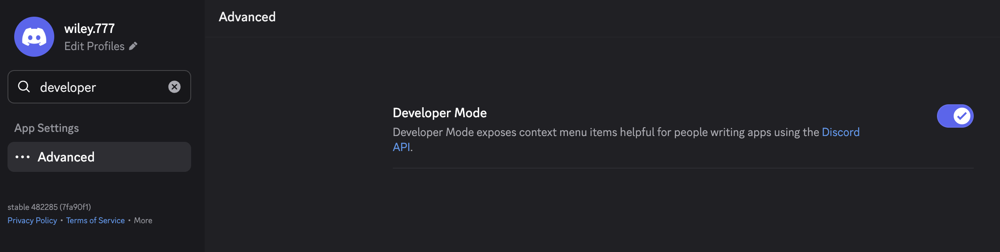
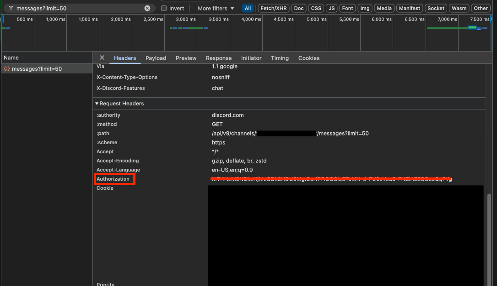
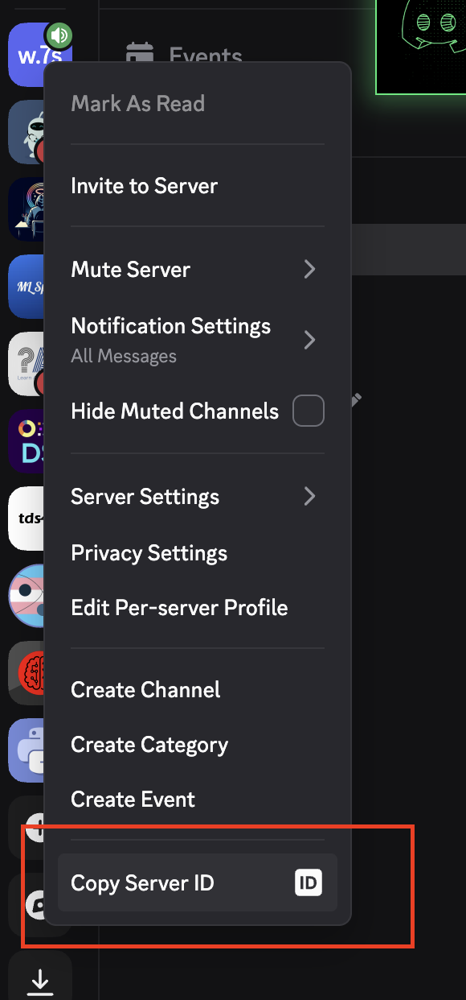
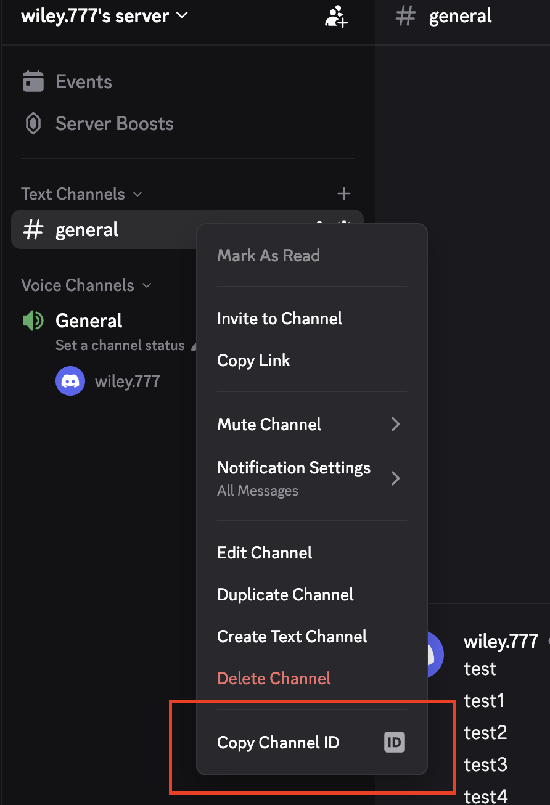

# Clyder: A Discord Data Analysis Tool

## Overview

Clyder is a Python-based script designed for analyzing data from Discord servers. It allows users to retrieve messages from specified channels within a server and perform keyword-based searches on those messages. This tool is intended for data analysis purposes and **is not a scraper**. It is built to comply with Discord's Terms of Service, and users should ensure they have the appropriate permissions to access the data they are analyzing.

**Important**: You can only use this tool on servers you own. This tool supports using a bot token or your personal authorization token.

## Using the Tool

- **Fetch Messages**: Retrieve all messages from a specified Discord channel within an optional date range.
- **Keyword Search**: Search for specific keywords within the messages of a Discord channel.
- **Data Export**: Save the retrieved data as a CSV file for further analysis.
- **Rate Limit Handling**: Built-in rate limit management to ensure compliance with Discord API limits.
- **Robust Date Handling**: Validates and handles date inputs with timezone awareness.

## Disclaimer

By using this tool, you agree to comply with Discord's Terms of Service. This tool does not perform any scraping activities; instead, it leverages Discord's official API for data retrieval, respecting all rate limits and usage guidelines. Misuse of this tool, such as using it in ways that violate Discord's Terms of Service (e.g., unauthorized data collection, using self-bots), can result in account termination. The creator of this tool does not endorse or encourage any activities that violate Discord's Terms of Service.

## Usage

To use Clyder, you'll need to enable Developer Mode in Discord and gather your authorization token, server ID, and channel ID. Follow the steps below:



### Step 1: Enable Developer Mode in Discord

1. Open Discord and go to **User Settings** (gear icon in the bottom-left).
2. Navigate to **Advanced** tab.
3. Enable **Developer Mode**.
4. Close settings.

### Step 2: Obtain Your Authorization Token

1. Open your Discord server in a **Chromium-based browser** (Chrome, Edge, Brave, etc.).
2. Press `F12` to open **Developer Tools**.
3. Go to the **Network** tab.
4. Interact with Discord (scroll through channels, send a message, etc.).
5. In the Network tab's search/filter box, search for:

    ```
    messages?limit=50
    ```

6. Click on the result that appears.
7. Scroll down to **Request Headers** and find the **Authorization** header. It will look like:

    ```
    Authorization: Tl4gh9sd...
    ```

    Copy the entire value after "Authorization: ". This is your **Auth Token**.



### Step 3: Obtain Your Server ID

1. In Discord, right-click on your **server name/icon** (on the left sidebar).
2. Select **"Copy Server ID"** from the context menu.



### Step 4: Obtain Your Channel ID

1. In Discord, right-click on the **channel name** you want to analyze.
2. Select **"Copy Channel ID"** from the context menu.



### Step 5: Run the Tool

1. Clone the repository and navigate to the project directory:

    ```bash
    git clone <repository-url>
    cd Clyder
    ```

2. Install the required Python dependencies:

    ```bash
    pip install -r requirements.txt
    ```

3. Run the script:

    ```bash
    python Clyder.py
    ```

4. Follow the interactive prompts:
   - Enter your Discord bot token
   - Enter your server ID
   - Enter your channel ID
   - Choose to fetch all messages (a) or keyword search (k)
   - Optionally filter by date range
   - If doing keyword search, enter comma-separated keywords

## Exported Data

The tool will save the retrieved messages or keyword search results to a CSV file in the working directory.

## License

This project is licensed under the [MIT License](./LICENSE).
